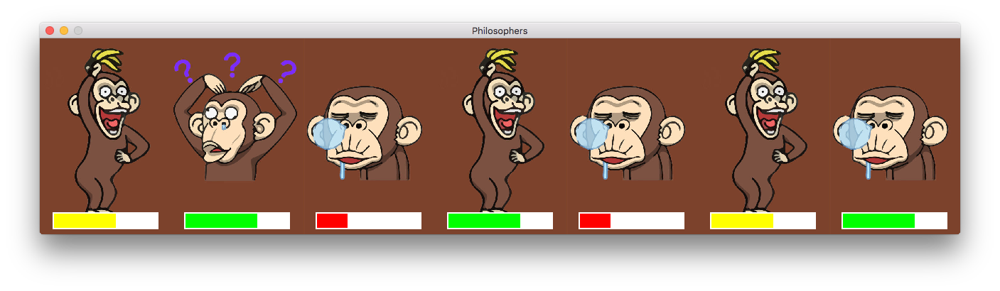

The Philosopher dinner
===================


School project realised consisting in solving the philosopher-dinner problem.
 
----------

Usage
-------------
```
./philo [-vh] [-s spritename]
```

Options
-------------

Option                                         | Purpose
---------------------------------------------- | ---
-v --verbose                                   | display only in verbose mode, no graphics
-s --sprite=[philo\|coco\|nyangoroge\|panpaka] | change sprite. philo is the default one
--audio                                        | activate music
--lifebar                                      | display life on the screen
--maxlife=n                                    | modify maxlife value set to 10 by default
--eat=n                                        | modify eat time value set to 4 by default
--rest=n                                       | modify rest time value set to 3 by default
--think=n                                      | modify think time value set to 3 by default
--timeout=n                                    | modify timeout value set to 60 by default
-h --help                                      | diplay this help message


----------

Dependencies
-------
You need to have the `CSFML` library installed in order to compile and run this project.


----------

Examples
-------

```
./philo
```


```
./philo --lifebar --sprite=coco
```


```
./philo --lifebar --sprite=nyangoroge --audio --maxlife 50
```


```
./philo --lifebar --sprite=panpaka --timeout 100
```


----------

Contributors
-------

- [rclanget](https://github.com/rclanget)
- [ulefebvr](https://github.com/ulefebvr)